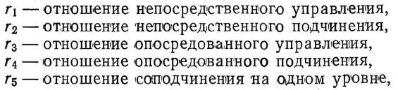

# Задание 2

## Суть: Получив на вход json-строку, описывающую граф, необходимо распарсить эту строку в произвольную структуру данных, а затем вывести матрицу, хранящую в себе информацию о количестве различных отношений управления для каждой вершины графа. Список отношений изображен на картинке ниже



### Пример входной строки
```json
{
    "1": {
        "2": {
            "3": {
                "5": {},
                "6": {}
            },
            "4": {
                "7": {},
                "8": {}

            }
        }
    }
}
```

### Пример выходных данных

Программа парсит json-строку вышеуказанного формата, сохраняет граф и рассчитывает вышеуказанные отношения. Итоговая матрица для тестовой входной строки, где i-тая строка это i-тое отношение, а j-тый столбец это j-тая вершина графа, выглядит следующим образом:

```
[0, 1, 1, 1, 1, 1, 1, 1]
[1, 2, 2, 2, 0, 0, 0, 0]
[0, 0, 1, 1, 2, 2, 2, 2]
[6, 4, 0, 0, 0, 0, 0, 0]
[0, 0, 1, 1, 1, 1, 1, 1]
```